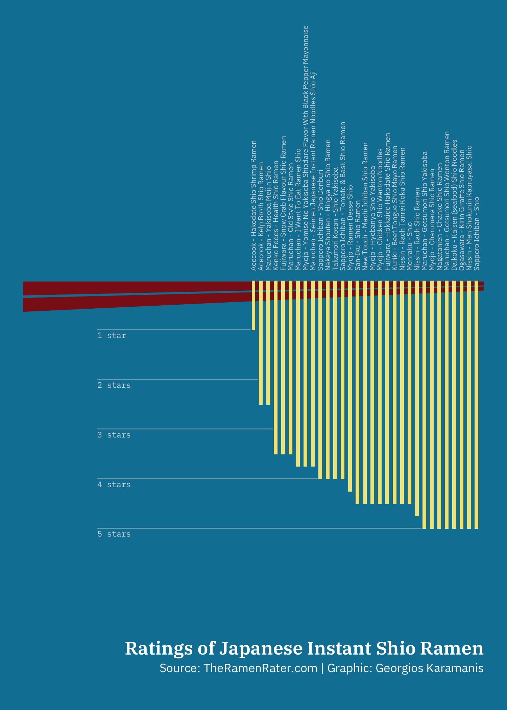

# `TidyTuesday`

```{r, include=FALSE}
WORDS_TO_IGNORE <- c("DS", "LinkedIn", "tidyr", "Kaupp's", "LEGO", "Eurovision", "tornados", "BAM", "Georgios", "Karamanis", "ramen", "Sprenger's", "Torsten")

source("knitr-options.R")
source("spelling-check.R")
```

```{r, echo=FALSE, fig.align='center', out.width='60%'}
knitr::include_graphics("images/tidy_tuesday_logo.jpg")
```

[`TidyTuesday`](https://github.com/rfordatascience/tidytuesday?tab=readme-ov-file) is a weekly social data project from the [Data Science Learning Community](https://dslc.io/) (previously called _R for data science (R4DS) Online Learning Community_). The aim of this activity is for learners and mentors to gather and work through the book [_R for Data Science_](https://r4ds.hadley.nz/) by Hadley Wickham; By doing so, help R learners understand how to summarize and arrange real-world data to make meaningful charts with [ggplot2](https://ggplot2.tidyverse.org/), [tidyr](https://tidyr.tidyverse.org/), [dplyr](https://dplyr.tidyverse.org/) and other tools from the [tidyverse](https://www.tidyverse.org/). 
`TidyTuesday` started as a podcast (you can find the podcast [online](https://www.tidytuesday.com/)) and has now become a safe and supportive space for individuals to practice their wrangling and data visualization skills independent of drawing conclusions.

Every Monday morning, a data set is posted to social media (on [Mastodon](https://fosstodon.org/@jonthegeek), [LinkedIn](https://www.linkedin.com/in/jonthegeek/) and [GitHub](https://github.com/rfordatascience/tidytuesday/blob/master/README.md)). 
The data set always comes from some source article, which means that participants learn to work with real-world data.
When the data has been posted to social media, all participants have time to explore the data, create visualizations, a model, a shiny app or some other data-science related output. In fact, participants do not have to use R; data-science-related output can be created in any programming language.
Finally, participants can share their output and the code that they used to generate it on social media with the hash tag `#TidyTuesday`. 

The first `TidyTuesday` data project was released in April 2018, and included data on US Tuition Costs. Since then, the Data Science Learning Community has posted more than 300 data sets retrieved from a variety of sources and covering many different topics; From [Star Trek Timelines](https://github.com/rfordatascience/tidytuesday/tree/master/data/2022/2022-12-27), to [CHIP data](https://github.com/rfordatascience/tidytuesday/tree/master/data/2022/2022-08-23), [UFO sightings](https://github.com/rfordatascience/tidytuesday/blob/master/data/2023/2023-06-20/readme.md), [Superbowl commercials](https://github.com/rfordatascience/tidytuesday/blob/master/data/2021/2021-03-02/readme.md), [Groundhog predictions](https://github.com/rfordatascience/tidytuesday/blob/master/data/2024/2024-01-30/readme.md), and many more. 
You can see the full list on the [`TidyTuesday` GitHub repository](https://github.com/rfordatascience/tidytuesday).

## Loading `TidyTuesday` data 

You can access any `TidyTuesday` data set with the package `tidytuesdayR`. `tidytuesdayR` includes several functions:

-`tt_available` : Lists all data sets ever released by `TidyTuesday`
- `last_tuesday` : Find the most recent `TidyTuesday` date
- `tt_download` : Download one or more `TidyTuesday` files
- `tt_load` : Load `TidyTuesday` data for a specified date from GitHub.

For example, you can load the `TidyTuesday` data from 14 January 2020 using

```{r, tidy='styler', collapse=TRUE, eval=FALSE}
tidytuesdayR::tt_load("2020-01-14")
```

If the data consists of more than one file, you can decide which files to download using the argument `download_files`:

```{r, tidy='styler', collapse=TRUE, eval=FALSE}
tidytuesdayR::tt_load("2020-05-05", download_files = "villagers")
```

## Inspiration {.unnumbered}

You can find inspiration from previous `TidyTuesday` projects online. Some examples are shown below:

- Jake Kaupp's contribution on Chicago Bird Collisions: 
<a href="https://github.com/jkaupp/tidytuesdays/tree/master/2019/week18">
    ```{r, echo=FALSE, fig.align='center', out.width='60%'}
  
    ```
</a>

<details><summary>I want to see the source code!</summary>

```{r, tidy='styler', collapse=TRUE, eval=FALSE}
pacman::p_load(tidyverse, lubridate, here, patchwork)

bird_collisions <- read_csv("https://raw.githubusercontent.com/rfordatascience/tidytuesday/master/data/2019/2019-04-30/bird_collisions.csv")

plot_data <- bird_collisions %>%
  filter(locality == "CHI") %>% 
  mutate(month = month(date),
         year = year(date)) %>% 
  unite("binomial_name", genus, species, sep = " ") %>% 
  count(year, month, binomial_name) %>% 
  complete(nesting(year, binomial_name), month = 1:12, fill = list(n = 0)) %>% 
  group_by(year, binomial_name) %>% 
  mutate(percent = n/sum(n)) %>% 
  mutate(percent = ifelse(is.nan(percent), 0, percent))

flower <- ggplot(plot_data, aes(x = month, y = percent, fill = binomial_name)) +
  geom_area(size = 0, position = position_dodge(), alpha = 0.2) +
  scale_x_continuous(labels = month.abb, breaks = 1:12) +
  scale_y_continuous(limits = c(0,1), breaks = c(0.5, 0.1)) +
  scale_fill_viridis_d("Year", option = "plasma", direction = 1) +
  scale_color_viridis_d(option = "plasma", direction = 1) +
  guides(fill = guide_colorbar()) +
  coord_polar() +
  labs(x = NULL,
       y = NULL,
       title = "Overall") +
  theme_minimal() +
  theme(axis.text.y = element_blank(),
        legend.position = "none",
        panel.grid = element_line(color = "#cccccc", size = 0.10),
        panel.grid.major.x = element_line(color = "#cccccc", size = 0.10),
        panel.grid.major.y = element_blank(),
        panel.grid.minor = element_blank(),
        legend.background = element_blank(),
        legend.key = element_blank(),
        plot.background = element_rect(fill = "white", color = "white"),
        text = element_text(color = "black"),
        axis.text = element_text(color = "black"),
        strip.text = element_text(hjust = 0, color = "black", size = 10),
        axis.ticks = element_blank(),
        axis.ticks.x = element_blank(),
        axis.ticks.y = element_blank(),
        axis.text.x = element_text(color = "black", margin = margin(t = 0.8 * 11/2)),
        #axis.text.y = element_text(color = "black", margin = margin(t = 0.8 * 11/2)),
        axis.title = element_text(size = 9),
        axis.title.x = element_text(hjust = 0.5, size = 9),
        axis.title.y = element_text(hjust = 0.5, size = 9),
        plot.margin = margin(11/2, 11/2, 11/2, 11/2),
        plot.title = element_text(hjust = 0, size = 14, margin = margin(b = 10)),
        plot.subtitle = element_text(hjust = 0, size = 12, margin = margin(b = 15)),
        plot.caption = element_text(hjust = 1, size = 9, margin = margin(t = 10)))

petals <- flower +
  aes(group = year) +
  geom_path(aes(color = binomial_name), size = 0.2, show.legend = FALSE) +
  labs(title = "By Species") +
  facet_wrap(~binomial_name, labeller = label_wrap_gen(10), nrow = 7)  +
  theme(axis.text.x = element_blank(),
        axis.text.y = element_blank())

legend <- plot_data %>% 
  filter(binomial_name == "Setophaga fusca") %>% 
  ggplot(aes(x = month, y = percent, fill = binomial_name, group = year)) +
  geom_area(size = 0, position = position_dodge(), alpha = 0.1) +
  geom_path(aes(color = binomial_name), size = 0.2, show.legend = FALSE) +
  annotate("text", x = 11, y = 0.8, label = "One year of\ncollisions in October", family = "Scope One", size = 3, hjust = 0) +
  annotate("segment", x = 10.8, y = 0.8, xend = 10, yend = 0.8, arrow = arrow(length = unit(0.2, "cm"))) +
  annotate("text", x = 3.5, y = 0.8, label = "Multiple years of\ncollisions in May", family = "Scope One", size = 3) +
  annotate("segment", x = 3.8, y = 0.8, xend = 5, yend = 0.8, arrow = arrow(length = unit(0.2, "cm"))) +
  scale_x_continuous(labels = month.abb, breaks = 1:12) +
  scale_y_continuous(limits = c(0,1), breaks = c(0.5, 0.1)) +
  scale_fill_viridis_d("Year", option = "plasma", direction = 1) +
  scale_color_viridis_d(option = "plasma", direction = 1) +
  labs(x = NULL,
       y = NULL,
       title = "How to Interpret This Chart",
       subtitle = str_wrap("A flower represents the recorded total collisions of each bird species with the individual petals representing the normalized events during each year (from 0-1).  The position of the petals indicates the month or months collisions occur, with overlaps indicating repeated year-over-year collisions.", 70)) +
  guides(fill = guide_colorbar()) +
  coord_polar(theta = "x", start = 0) +
  theme_minimal() +
  theme(axis.text.y = element_blank(),
        panel.grid.major.y = element_line(color = "#cccccc", size = 0.10),
        plot.title = element_text(hjust = 0, size = 14, margin = margin(b = 10)),
        legend.position = "none")

out <- wrap_plots(flower / legend, plot_spacer(), petals, ncol = 3, widths = c(1, 0.2, 2)) +
  plot_annotation(title = "Seasonality of Bird Collisions in Chicago",
                  subtitle = str_wrap("Presented below is a petal chart of of bird collisions, with instructions on how to interpret this chart in the lower left. The upper left flower represents collisions recorded across all years and species, with individual species presented as small multiple flowers on the right.", 220),
                  caption = "Data: Winger et al. (2019) Nocturnal flight-calling behaviour predicts vulnerability to artificial light in migratory birds. Proceedings of the Royal Society B 286(1900): 20190364. https://doi.org/10.1098/rspb.2019.0364 | Graphic: @jakekaupp",
      theme(plot.title.position = "plot"))
```

</details>
<br>

- Georgios Karamanis' visualization of instant ramen reviews: 
<a href="https://github.com/gkaramanis/tidytuesday/tree/master/2019/2019-week-23">
    ```{r, echo=FALSE, fig.align='center', out.width='60%'}
  
    ```
</a>

<details><summary>I want to see the source code!</summary>

```{r, tidy='styler', collapse=TRUE, eval=FALSE}
pacman::p_load(tidyverse)

ramen_ratings <- readr::read_csv("https://raw.githubusercontent.com/rfordatascience/tidytuesday/master/data/2019/2019-06-04/ramen_ratings.csv")

shio <- ramen_ratings %>%
  filter(country == "Japan", str_detect(variety, "Shio")) %>% 
  arrange(., stars) %>%
  mutate(n = 1:n())

ggplot() +
  # chopstics
  geom_polygon(aes(x = c(-30, 32, 32, -30), y = c(0.02, 0.02, 0.1, 0.3)),
               fill = "firebrick4") +
  geom_polygon(aes(x = c(-30, 32, 32, -30), y = c(0.35, 0.12, 0.2, 0.63)),
               fill = "firebrick4") +
  # stars
  geom_text(aes(x = -20,  y = c(1.1, 2.1, 3.1, 4.1, 5.1),
                label = c("1 star", "2 stars", "3 stars", "4 stars", "5 stars")),
            color = "gray85", size = 2, hjust = 0,
            family = "IBM Plex Mono") +
  geom_segment(aes(x = -20, y = c(0.99, 1.99, 2.99, 3.99, 4.99),
                   xend = c(0.6, 1.6, 3.6, 9.6, 23.6), yend = c(0.99, 1.99, 2.99, 3.99, 4.99)),
               color = "gray85", size = 0.3, alpha = 0.5) +
  # 5 starred
  geom_text(data = shio, aes(x = n, y = -0.2,
                label = paste(brand, variety, sep = " - ")),
            size = 1.8, family = "IBM Plex Sans",
            hjust = 0, angle = 90, color = "gray85") +
  # ramen               
  geom_col(data = shio, aes(n, stars), width = 0.5, fill = "khaki") +
  
  scale_y_reverse(limits = c(8, -5), breaks = c(1, 2, 3, 4, 5),
  position = "right") +
  # title, subtitle and caption
  geom_text(aes(x = 32, y = 7.4, label = "Ratings of Japanese Instant Shio Ramen"),
            family = "IBM Plex Serif SemiBold", hjust = 1,
            color = "white", size = 4.5) +
  geom_text(aes(x = 32, y = 7.8, label = "Source: TheRamenRater.com | Graphic: Georgios Karamanis"),
            hjust = 1, color = "white", size = 3) +
  theme_void() +
  theme(
    panel.background = element_rect(fill = "#0881A3", color = "#0881A3"))

```

</details>
<br>

- Georgios Karamanis' histogram of UFO sightings: 
<a href="https://github.com/gkaramanis/tidytuesday/tree/master/2019/2019-week-26">
    ```{r, echo=FALSE, fig.align='center', out.width='60%'}
  knitr::include_graphics("images/tidy_tuesday_georgios_karamanis_ufo.png")
    ```
</a>

<details><summary>I want to see the source code!</summary>

```{r, tidy='styler', collapse=TRUE, eval=FALSE}
pacman::p_load(tidyverse, here, ggimage)

ufo_sightings <- readr::read_csv("https://raw.githubusercontent.com/rfordatascience/tidytuesday/master/data/2019/2019-06-25/ufo_sightings.csv")

city_count <- ufo_sightings %>%
  mutate(every_year = str_sub(date_time, -10, -7)) %>% 
  group_by(city_area) %>% 
  summarise(total = n(), first_encounter = min(every_year)) %>% 
  top_n(n = 10, total) %>% 
  mutate(year = as.numeric(first_encounter),
         city_area = str_to_title(city_area),
         city_area = fct_reorder(city_area, year))
  
ggplot(city_count) +
  geom_segment(aes(x = city_area, y = year, 
                   xend = city_area, yend = 1970,
                   size = total),
               color = "orange1") +
  geom_image(aes(image = here("images", "UFO_image.png"),
                 x = city_area, y = year - 0.8),
             asp = 1.4, size = 0.05, color = "purple3") +
  geom_text(aes(label = year,
                x = city_area, y = year - 3),
            color = "grey40",
            size = 5, alpha = 0.6) +
  geom_text(aes(label = total,
                x = city_area, y = 1967.5),
            nudge_x = 0.37, size = 8, alpha = 0.7,
            color = "orange1") +
  geom_text(aes(label = "year of first reported\nencounter at the city",
                x = 3, y = 1941),
            color = "grey60",
            size = 5, alpha = 0.9, hjust = 0) +
  geom_segment(aes(x = 2.8, y = 1941,
                   xend = 1.4, yend = 1941),
               color = "grey60", alpha = 0.5) +
  geom_text(aes(label = "total number of encounters\nduring all years",
                x = 8, y = 1950),
            color = "orange1",
            size = 5, alpha = 0.2, hjust = 0) +
  geom_segment(aes(x = 7.8, y = 1950,
                   xend = 6.4, yend = 1955),
               color = "orange1", alpha = 0.2) +
  scale_y_reverse(position = "right") +
  coord_cartesian(ylim = c(1940, 1967)) +
  geom_text(aes(label = "Top 10 cities in the world with\nthe most reported UFO encounters",
                x = 11, y = 1941),
            size = 8, hjust = 1) +
  labs(
    # title = "Top 10 cities\nin the world with\nthe most reported\nUFO encounters",
    caption = "Source: NUFORC | Graphics: Georgios Karamanis") +
  theme_minimal() +
  theme(
    plot.background = element_rect(fill = "#e0e7f3",
                                   colour = "#e0e7f3"),
    panel.grid = element_blank(),
    legend.position = "",
    text = element_text(size = 14),
    axis.title = element_blank(),
    axis.text.y = element_blank(),
    axis.text.x = element_text(size = 14, hjust = 0.2, color = "purple3"),
    plot.margin = unit(c(1, 1, 1, 1), "cm"),
    plot.caption = element_text(margin = margin(40, 0, 0, 0), color = "grey60")
  ) 

```

</details>
<br>

- Dr. Torsten Sprenger's visualizations of the gender bias in scientific publishing: 
<a href="https://github.com/spren9er/tidytuesday/blob/master/tidytuesday_201916_new_economist.r">
    ```{r, echo=FALSE, fig.align='center', out.width='60%'}
  knitr::include_graphics("images/tidy_tuesday_torsten_sprenger.png")
    ```
</a>

<details><summary>I want to see the source code!</summary>

```{r, tidy='styler', collapse=TRUE, eval=FALSE}
pacman::p_load(tidyverse)

raw_data <- read_csv(
  paste0(
    'https://raw.githubusercontent.com/rfordatascience/tidytuesday/',
    'master/data/2019/2019-04-16/women_research.csv'
  )
)

women_research <- raw_data %>%
  mutate(
    field = gsub('Women Inventores', 'Inventors', str_to_title(field)),
    percent_men = 1 - percent_women,
    women_ratio = ifelse(percent_women < percent_men, 'less', 'not_less')
  ) %>%
  pivot_longer(
    starts_with('percent'), names_to = 'sex', values_to = 'percent',
    names_prefix = 'percent_'
  )

women_field_averages <- women_research %>%
  filter(sex == 'women') %>%
  group_by(field) %>%
  summarize(avg_field_percent = mean(percent)) %>%
  arrange(avg_field_percent)

women_country_averages <- women_research %>%
  filter(sex == 'women') %>%
  group_by(country) %>%
  summarize(avg_country_percent = mean(percent)) %>%
  arrange(avg_country_percent)

plot <- women_research %>%
  mutate(
    field = factor(field, levels = women_field_averages$field),
    country = factor(country, levels = women_country_averages$country),
    sex_women_ratio = interaction(sex, women_ratio)
  ) %>%
  ggplot() +
    geom_bar(
      aes(x = '', y = percent, fill = sex_women_ratio, color = women_ratio),
      stat = 'identity', show.legend = FALSE
    ) +
    scale_fill_manual(values = c('#efefef', '#333333', '#efefef', '#c54950')) +
    scale_color_manual(values = c('#333333', '#c54950')) +
    coord_polar('y', start = 0) +
    facet_grid(field ~ country, switch = 'y') +
    labs(
      x = '',
      y = '',
      title = "Still a man's world",
      subtitle = paste(
        '#tidytuesday 16|2019',
        'women among researchers with papers published 2011-2015',
        sep = ' • '
      ),
      caption = '© 2019 spren9er'
    )

plot +
  theme_minimal() +
  theme(
    panel.border = element_blank(),
    panel.grid = element_blank(),
    panel.spacing.x = unit(0.9, 'lines'),
    panel.spacing.y = unit(0.9, 'lines'),
    axis.title.x = element_blank(),
    axis.ticks.x = element_blank(),
    axis.text.x = element_blank(),
    strip.background = element_blank(),
    strip.text = element_text(size = 9, face = 'plain'),
    strip.text.x = element_text(angle = 90, hjust = 0, margin = margin(b = 10)),
    strip.text.y = element_text(
      angle = 180, hjust = 1, margin = margin(r = 10)
    ),
    plot.title = element_text(face = 'bold', margin = margin(b = 7)),
    plot.subtitle = element_text(margin = margin(b = 20)),
    plot.caption = element_text(
      color = '#333333', face = 'plain', size = 7, hjust = 1,
      margin = margin(t = 20)
    )
  )
```
</details>
<br>


## Advanced R Project - `TidyFriday`

Let's make our own mini version of `TidyTuesday`. As you will present your results on Friday, we can call this project `TidyFriday` `r emo::ji("wink")`.

1. Work together in teams of 2 (or 3).
1. Choose a data set from the list of available `TidyTuesday` data sets (`tidytuesdayR::tt_available()`).
1. Come up with a question or find interesting aspects to visualize. You can also recreate an existing visualization.
1. Apply the functions you have learned in this course and try to learn new things to create an interesting plot.
1. Share the resulting plot(s) and the code on GitHub.

Friday afternoon, you will give a short presentation where you talk about challenges and conclusions from the plot.

### Presentation {.unnumbered}

Make a short (5-10 min) presentation. You can simply make an HTML file from R Markdown and upload it to GitHub. The HTML file can then be previewed on <http://htmlpreview.github.io/>. The presentation should include:

- A short introduction to the data set and the variables you chose to visualize
- Your results and a discussion about the trends/patterns in the data
- If you chose to recreate a visualization, comment on the quality of the plot or potential problems
- The generative code and comments on the steps and transformations you applied to the data
- Potential other tidyverse functions or packages that were particularly useful

### Examples {.unnumbered}

Below, you can find some examples from previous years:

- [Alcohol Consumption](presentations/alcohol-consumption.html)

- [LEGO sets](presentations/lego.html)

- [F1 winners](presentations/f1.html)

- [Baby Names](presentations/baby-names.html)

- [UFO sightings](presentations/UFO_Sightings.html)

- [Tornados](presentations/tornados.html)

- [Wealth Inequalities in the USA](presentations/wealth-inequalities.html)

- [Eurovision](presentations/TidyTuesday_Eurovision.html)

- [Horror Movies](presentations/Horror-movies.docx)

- [A Package for Clinical Data](presentations/package-stRoke.html)

- [A Package to read BAM files](presentations/package_banalyzer.html)
